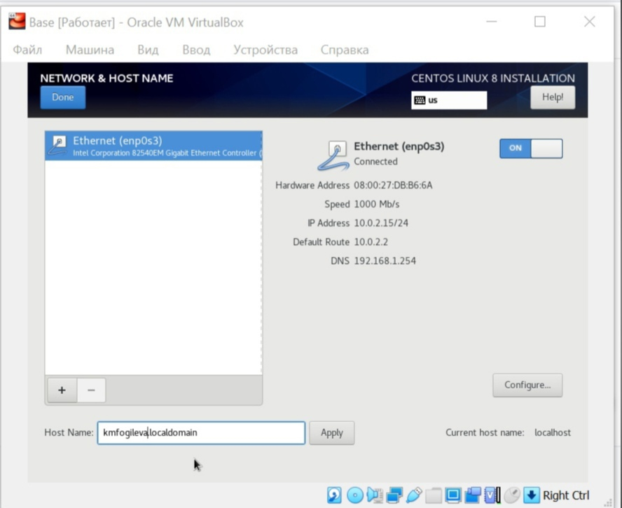

---
# Front matter
title: "Отчет по лабораторной работе 1"
subtitle: "Дисциплина: Информационная безопасность"
author: "Фогилева Ксения Михайловна, НПИбд-02-18"

# Generic otions
lang: ru-RU
toc-title: "Содержание"

# Bibliography
bibliography: bib/cite.bib
csl: pandoc/csl/gost-r-7-0-5-2008-numeric.csl

# Pdf output format
toc: true # Table of contents
toc_depth: 2
lof: true # List of figures
lot: true # List of tables
fontsize: 12pt
linestretch: 1.5
papersize: a4
documentclass: scrreprt
## I18n
polyglossia-lang:
  name: russian
  options:
	- spelling=modern
	- babelshorthands=true
polyglossia-otherlangs:
  name: english
### Fonts
mainfont: PT Serif
romanfont: PT Serif
sansfont: PT Sans
monofont: PT Mono
mainfontoptions: Ligatures=TeX
romanfontoptions: Ligatures=TeX
sansfontoptions: Ligatures=TeX,Scale=MatchLowercase
monofontoptions: Scale=MatchLowercase,Scale=0.9
## Biblatex
biblatex: true
biblio-style: "gost-numeric"
biblatexoptions:
  - parentracker=true
  - backend=biber
  - hyperref=auto
  - language=auto
  - autolang=other*
  - citestyle=gost-numeric
## Misc options
indent: true
header-includes:
  - \linepenalty=10 # the penalty added to the badness of each line within a paragraph (no associated penalty node) Increasing the value makes tex try to have fewer lines in the paragraph.
  - \interlinepenalty=0 # value of the penalty (node) added after each line of a paragraph.
  - \hyphenpenalty=50 # the penalty for line breaking at an automatically inserted hyphen
  - \exhyphenpenalty=50 # the penalty for line breaking at an explicit hyphen
  - \binoppenalty=700 # the penalty for breaking a line at a binary operator
  - \relpenalty=500 # the penalty for breaking a line at a relation
  - \clubpenalty=150 # extra penalty for breaking after first line of a paragraph
  - \widowpenalty=150 # extra penalty for breaking before last line of a paragraph
  - \displaywidowpenalty=50 # extra penalty for breaking before last line before a display math
  - \brokenpenalty=100 # extra penalty for page breaking after a hyphenated line
  - \predisplaypenalty=10000 # penalty for breaking before a display
  - \postdisplaypenalty=0 # penalty for breaking after a display
  - \floatingpenalty = 20000 # penalty for splitting an insertion (can only be split footnote in standard LaTeX)
  - \raggedbottom # or \flushbottom
  - \usepackage{float} # keep figures where there are in the text
  - \floatplacement{figure}{H} # keep figures where there are in the text
---

# Цель работы

Приобретение практических навыков установки операционной системы на виртуальную машину, настройки минимально необходимых для дальнейшей работы сервисов.

# Задание

Лабораторная работа подразумевает установку на виртуальную машину VirtualBox операционной системы Linux, дистрибутив Centos.

# Теоретическое введение

Ааа

# Выполнение лабораторной работы

1. Загрузила на своем компьютере операционную систему Windows. Осуществила вход в систему.

2. Перешла в каталог, предназначенный для данного предмета.

3. Создала каталог с именем пользователя kmfogileva.

4. Перешла в каталог "Загрузки", где размещён образ виртуальной машины.

5. Скопировала образ виртуальной машины в созданный на предыдущем шаге каталог.

6. Запустила виртуальную машину (рис. [-@fig:001]).

{ #fig:001 width=70% }

7. Проверила в свойствах VirtualBox месторасположение каталога для виртуальных машин. Для этого в VirtualBox выбрала "Файл" -> "Свойства", вкладка "Общие". 
В поле "Папка для машин" (рис. [-@fig:002]) должен стоять каталог kmfogileva, расположенный в папке ИБ.

{ #fig:002 width=70% }

8. Создала новую виртуальную машину. Для этого в VirtualBox выбрала "Машина" -> "Создать". Указала имя виртуальной машины — Base, тип операционной системы — 
Linux, RedHat. Указала размер основной памяти виртуальной машины — 1024 МБ. Также создала новый виртуальный жесткий диск. (рис. [-@fig:003])

{ #fig:003 width=70% }

9. Задать конфигурацию жесткого диска — загрузочный, VDI (VirtualBox Disk Image), динамический виртуальный диск. Задала размер диска — 40 ГБ и его 
расположение. (рис. [-@fig:004])

{ #fig:004 width=70% }

10. В VirtualBox появилась новая виртуальная машина (рис. [-@fig:006]).

11. Выделила в окне менеджера VirtualBox виртуальную машину Base и открыла окно "Свойства". Проверила, что папка для снимков виртуальной машины Base имеет 
путь <Моя папка>/Base/Snapshots. Для этого выбрала в VirtualBox "Свойства" виртуальной машины Base -> "Общие", вкладка "Дополнительно" (рис. [-@fig:005]).

{ #fig:005 width=70% }

12. Выбрала в VirtualBox "Свойства" -> "Носители" виртуальной машины Base. Добавила новый привод оптических дисков и выбрала нужный образ (рис. [-@fig:006]).

{ #fig:006 width=70% }

13. Запустила виртуальную машину Base, выбрала установку системы.

14. Установила английский язык для процесса установки, т. к. при установке русского языка у меня сильно обрезалось окно установки.

15. В качестве имени машины указала «kmfogileva.localdomain» (рис. [-@fig:007]).

{ #fig:007 width=70% }

16. Указала часовой пояс «Москва» (рис. [-@fig:008]).

{ #fig:008 width=70% }

17. Установила пароль для root (рис. [-@fig:009]).

{ #fig:009 width=70% }

18. Создала пользователя kmfogileva (рис. [-@fig:010]).

{ #fig:010 width=70% }

19. Проверила все пункты и начала установку.

20. Завершила установку операционной системы и перезагрузила её.

21. В VirtualBox оптический диск отключился автоматически .

22. Запустила виртуальную машину. Приняла лицензию

23. Подключилась к виртуальной машине с помощью созданной учётной записи (рис. [-@fig:011]).

{ #fig:011 width=70% }

24. Настроила все, что требовалось.

25. На виртуальной машине Base запустила терминал, перешла под учетную запись root с помощью команды su. С помощью команды yum update 
обновила системные файлы. (рис. [-@fig:012]).

{ #fig:012 width=70% }

26. Установила необходимые программы (mc) (рис. [-@fig:013].

{ #fig:013 width=70% }

27. После установки необходимых программ завершила работу виртуальной машины.

28. Для того чтобы другие виртуальные машины могли использовать машину Base и её конфигурацию как базовую, произвела следующие действия. В VirtualBox в меню 
выбрала "Файл" -> "Менеджер виртуальных носителей" -> "Жёсткие диски" и, выделив «Base.dvi», указала "Отключить". (рис. [-@fig:014] и [-@fig:014])

{ #fig:014 width=70% }

29. На основе виртуальной машины Base создала машину Host2, выбрав в VirtualBox "Машина" -> "Создать" и в "Мастере создания новой виртуальной машины" указав 
в качестве имени машины Host2, в качестве типа операционной системы — Linux, версия RedHat, а при конфигурации виртуального жёсткого диска выбрав 
"Использовать существующий жёсткий диск" Base.vdi. (рис. [-@fig:015])

{ #fig:015 width=70% }

# Выводы

Приобрела практические навыки установки операционной системы на виртуальную машину, настройки минимально необходимых для дальнейшей работы сервисов.

# Список литературы{.unnumbered}

1. Кулябов Д. С., Королькова А. В., Геворкян М. Н. Информационная безопасность компьютерных сетей. Лабораторная работа № 1. Установка и конфигурация 
операционной системы на виртуальную машину