---
## Front matter
lang: ru-RU
title: Отчет по Лабораторной работе №2
author: |
	Фогилева Ксения Михайловна НПИбд-02-18\inst{1}
institute: |
	\inst{1}RUDN University, Moscow, Russian Federation

## Formatting
toc: false
slide_level: 2
theme: metropolis
header-includes: 
 - \metroset{progressbar=frametitle,sectionpage=progressbar,numbering=fraction}
 - '\makeatletter'
 - '\beamer@ignorenonframefalse'
 - '\makeatother'
aspectratio: 43
section-titles: true
---

## Цель работы
Получение практических навыков работы в консоли с атрибутами файлов, закрепление теоретических основ дискреционного разграничения доступа в современных 
системах с открытым кодом на базе ОС Linux.

# Выполнение лабораторной работы
## **Создание пользователя**

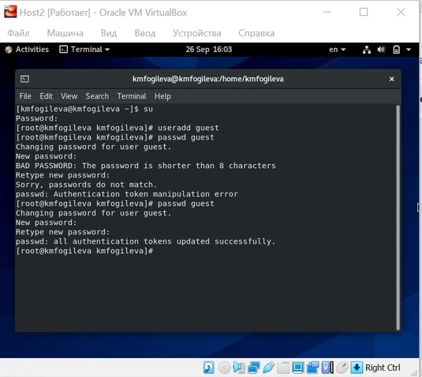{ #fig:001 width=50% }

## **Вошла в систему под новым пользователем**

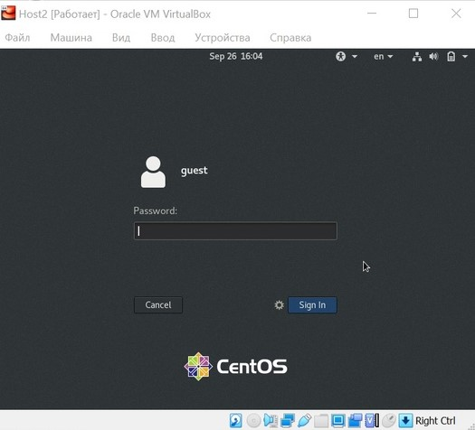{ #fig:002 width=50% }

## **Определила директорию, в которой я нахожусь, командой *pwd*.**

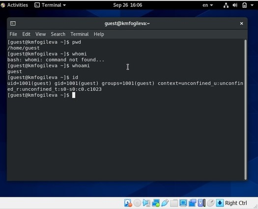{ #fig:003 width=50% }

## **Посмотрела файл**

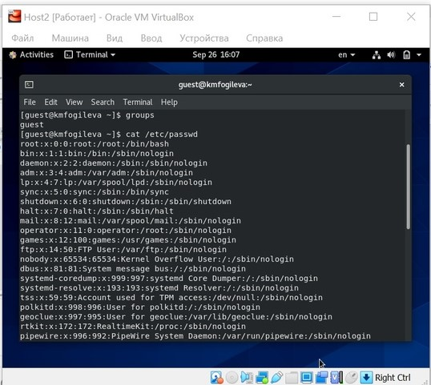{ #fig:004 width=30% }

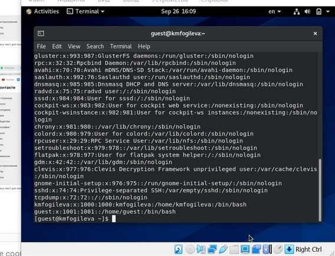{ #fig:005 width=30% }

## **Создала в домашней директории поддиректорию dir1: mkdir dir1.**

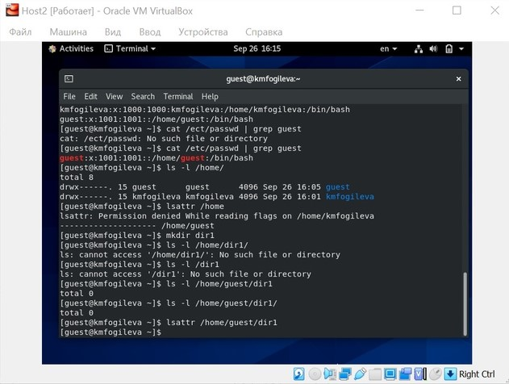{ #fig:007 width=30% }

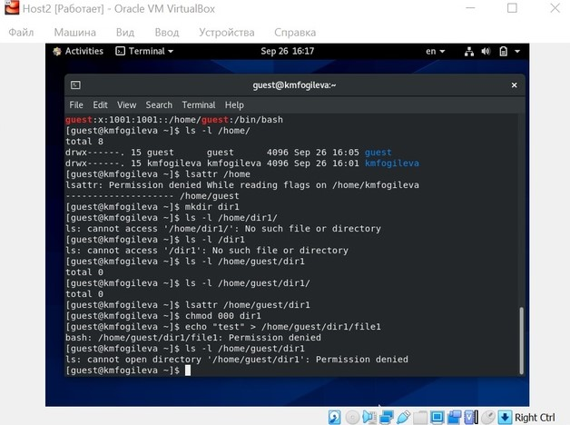{ #fig:008 width=30% }

## **Таблица**

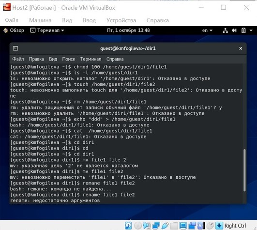{#fig:009 width=30% }

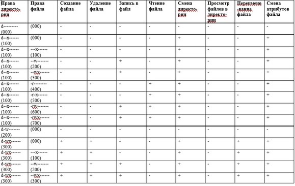{ #fig:010 width=30% }

## **Таблица**

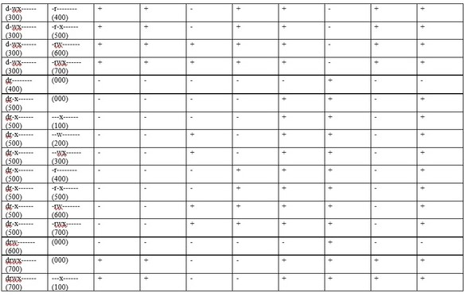{ #fig:011 width=30% }

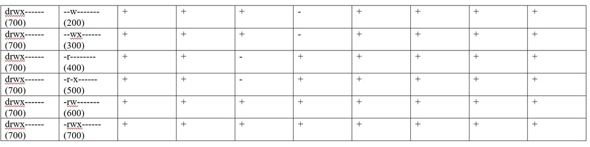{ #fig:012 width=30% }

## **Минимальные права**

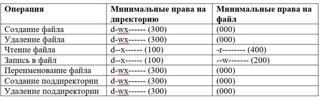{ #fig:013 width=70% }

## Вывод

Получила практические навыки работы в консоли с атрибутами файлов, закрепила теоретические основы дискреционного разграничения доступа в современных 
системах с открытым кодом на базе ОС Linux.

## {.standout}

Спасибо за внимание!
