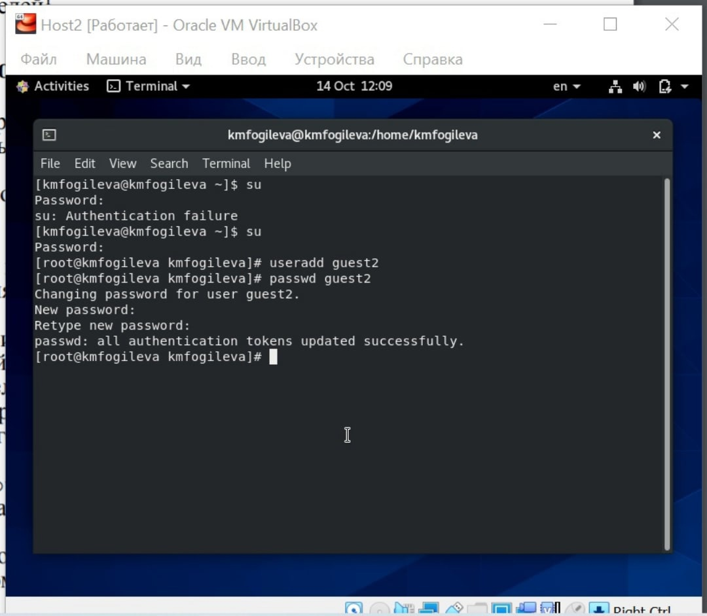
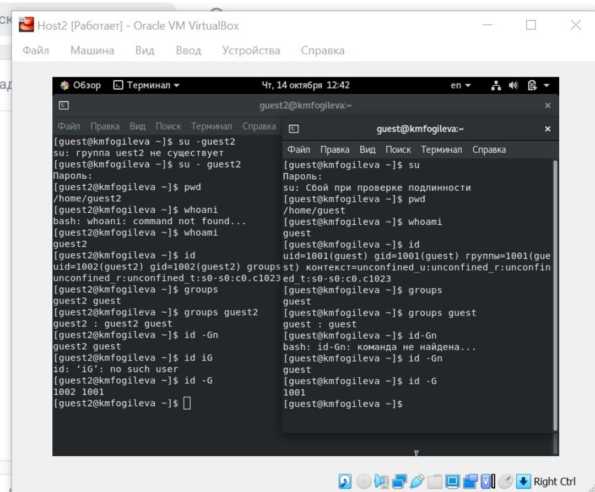
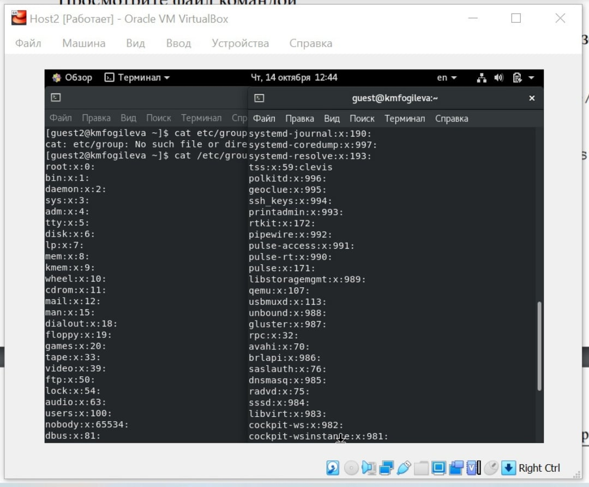
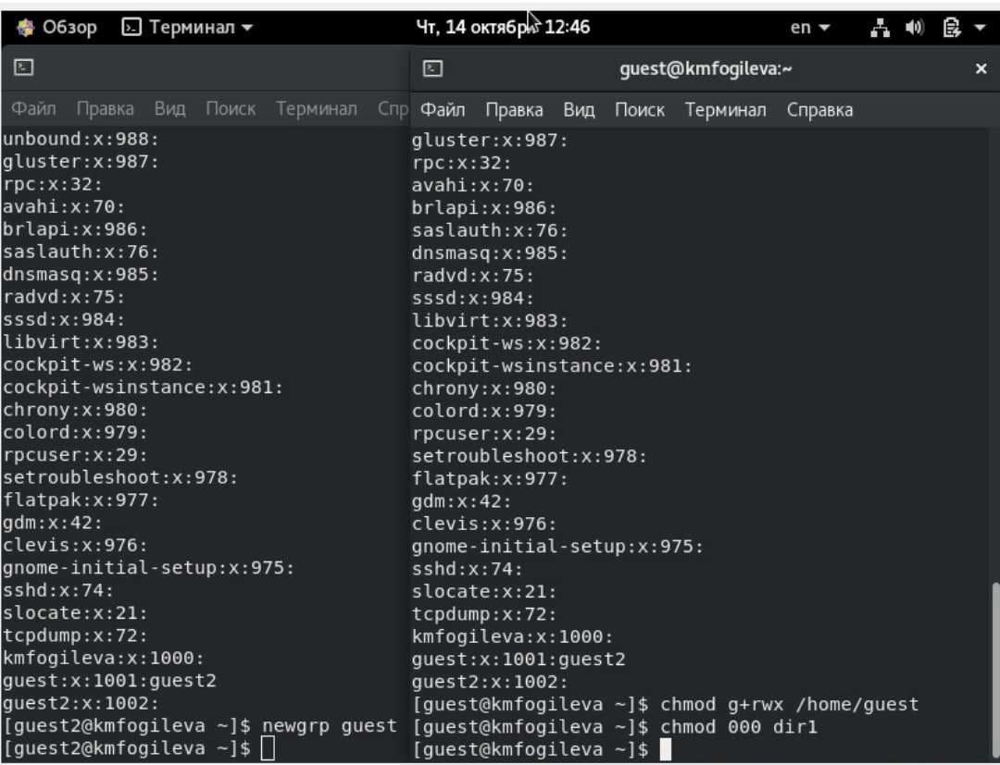
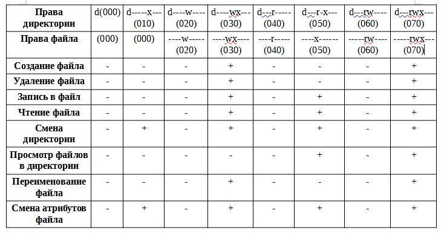
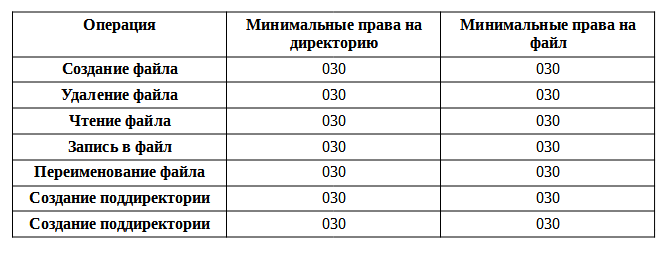

---
## Front matter
lang: ru-RU
title: "Лабораторная работа №3"
author: |
	Fogileva Kseniia\inst{1}

institute: |
	\inst{1}RUDN University, Moscow, Russian Federation

date: 14 October, Moscow, Russian Federation

## Formatting
toc: false
slide_level: 2
theme: metropolis
header-includes:
 - \metroset{progressbar=frametitle,sectionpage=progressbar,numbering=fraction}
 - '\makeatletter'
 - '\beamer@ignorenonframefalse'
 - '\makeatother'
aspectratio: 43
section-titles: true
---

# Цель выполнения лабораторной работы

## Цель выполнения лабораторной работы

- Получение практических навыков работы в консоли с атрибутами файлов для групп пользователей.

# Ход выполнения лабораторной работы

## 1. В установленной операционной системе создалf учётную запись пользователя guest2. Задала пароль для пользователя guest2. Добавила пользователя guest2 в группу guest (рис. 1).
{ #fig:001 width=70% }

## 2. Осуществила вход в систему от двух пользователей на двух разных консолях: guest на первой консоли и guest2 на второй консоли. Для обоих пользователей определила директорию,в которой нахожусь: /home/guest и /home/guest2, что соответствует приглашениям командной строки. Для пользователя guest: имя пользователя - guest, его группа 1001(guest), принадлежит к группе guest. Для пользователя guest2: имя пользователя - guest2, его группа 1002(guest2), принадлежит к группам guest и guest2.Вывод команды groups аналогичем выводам команд id -Gn и id -G (рис. 2).
{ #fig:002 width=70% }

## 3. Сравнила полученную информацию с содержимым файла /etc/group (рис. 3).

{ #fig:003 width=70% }

## 4. От имени пользователя guest2 выполнила регистрацию пользователя guest2 в группе guest (рис. 4).
{ #fig:004 width=70% }

## 5. От имени пользователя guest изменилf права директории /home/guest, разрешив все действия для пользователей группы. Снялf с директории /home/guest/dir1 все атрибуты проверил правильность снятия атрибутов (рис. 5).
{ #fig:005 width=70% }

## 6. Заполнилf таблицы (рис. 6, 7).
{ #fig:006 width=70% }
{ #fig:007 width=70% }

# Выводы

## Выводы

Получилf практические навыки работы в консоли с атрибутами файлов для групп пользователей.

## {.standout}

Спасибо за внимание!
