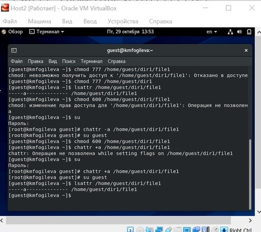
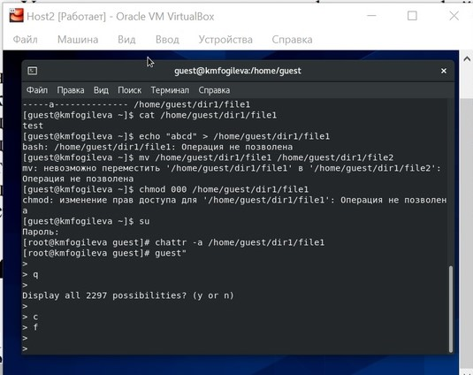
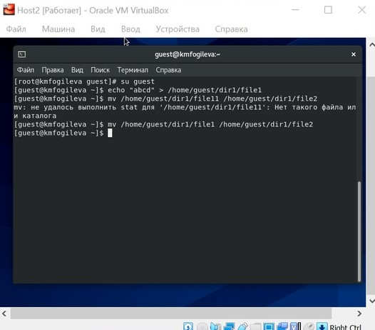
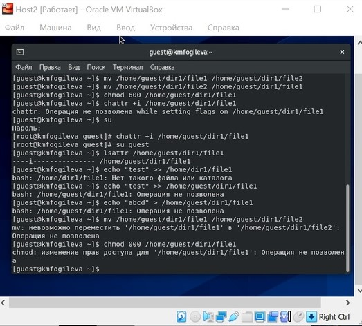

---
## Front matter
lang: ru-RU
title: "Лабораторная работа №4"
author: |
	Fogileva Ksenia Mikhailovna\inst{1}

institute: |
	\inst{1}RUDN University, Moscow, Russian Federation
	
date: 29.10.2021, Moscow, Russian Federation

## Formatting
toc: false
slide_level: 2
theme: metropolis
header-includes: 
 - \metroset{progressbar=frametitle,sectionpage=progressbar,numbering=fraction}
 - '\makeatletter'
 - '\beamer@ignorenonframefalse'
 - '\makeatother'
aspectratio: 43
section-titles: true
---

# Цель выполнения лабораторной работы

## Цель выполнения лабораторной работы

- Получение практических навыков работы в консоли с расширенными атрибутами файлов.

# Ход выполнения лабораторной работы

## 1. От имени пользователя guest определила расширенные атрибуты файла /home/guest/dir1/file. Установила командой на файл file1 права, разрешающие чтение и запись для владельца файла. (рис. 1)
{ #fig:001 width=70% }

## 2. Попробовала установить на файл/home/guest/dir1/file1 расширенный атрибут a от имени пользователя guest. Попробовала установить расширенный атрибут a на файл /home/guest/dir1/file1 от имени суперпользователя. От пользователя guest проверила правильность установления атрибута. Выполнила дозапись в файл file1 слова «test». После этого выполнила чтение файла file1. Убедилась, что слово test было успешно записано в file1. Попробовала удалить файл file1. Попробовала переименовать файл. Попробовала установить на файл file1 права, например, запрещающие чтение и запись для владельца файла. Не удалось успешно выполнить указанные команды? Снял расширенный атрибутa с файла/home/guest/dirl/file1 от имени суперпользователя. Повторил операции, которые ранее не удавалось выполнить. Они были успешно исполнены (рис. 2 и рис.3).

## { #fig:002 width=70% }

## { #fig:003 width=70% }

## 3. Повторил действия по шагам,заменив атрибут «a» атрибутом «i». Дозаписать информацию не удалось (рис. 4).
{ #fig:004 width=70% }

# Выводы

## Выводы

Получила практические навыки работы в консоли с расширенными атрибутами файлов.

## {.standout}

Спасибо за внимание!