---
## Front matter
lang: ru-RU
title: "Лабораторная работа №5"
author: |
	Fogileva Ksenia Mikhailovna\inst{1}

institute: |
	\inst{1}RUDN University, Moscow, Russian Federation
	
date: 29.10.2021, Moscow, Russian Federation

## Formatting
toc: false
slide_level: 2
theme: metropolis
header-includes: 
 - \metroset{progressbar=frametitle,sectionpage=progressbar,numbering=fraction}
 - '\makeatletter'
 - '\beamer@ignorenonframefalse'
 - '\makeatother'
aspectratio: 43
section-titles: true
---

# Цель выполнения лабораторной работы

## Цель выполнения лабораторной работы

Изучение механизмов изменения идентификаторов, применения
SetUID- и Sticky-битов. Получение практических навыков работы в консоли с дополнительными атрибутами. Рассмотрение работы механизма
смены идентификатора процессов пользователей, а также влияние бита
Sticky на запись и удаление файлов.

# Ход выполнения лабораторной работы

## 1. Загрузила gcc и  отключите систему запретов до очередной перезагрузки системы. (рис.1)
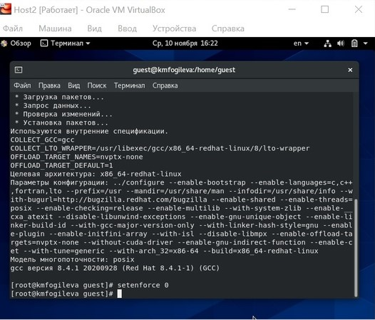{ #fig:001 width=70% }

## 2. Создала программу simpleid.c (рис.2).
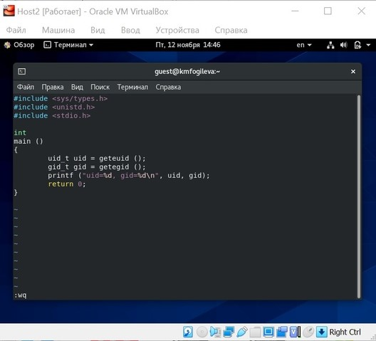{ #fig:002 width=70% }

## 3. Скомпилировала и выполнила программу simpleid, затем запустила id. Результаты совпали. (рис.3).
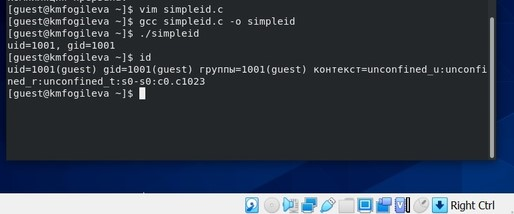{ #fig:003 width=70% }

## 4. Создала программу simpleid2.ca (рис.4).
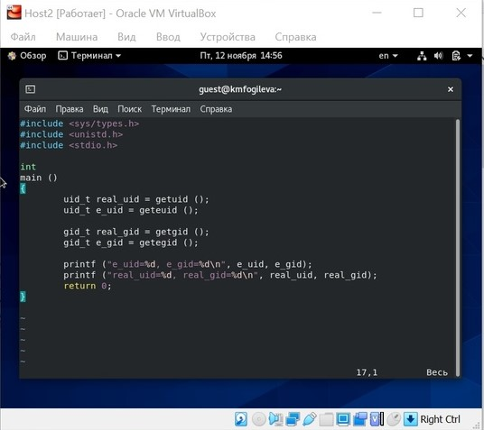{ #fig:004 width=70% }

## 5. . Скомпилировала и запустила simpleid2.c (рис.5).
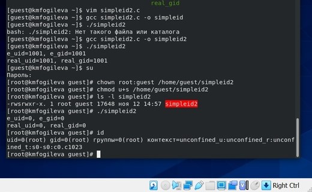{ #fig:005 width=70% }

## 6. Повысила права, выполнила команды, выполнила проверку правильности выполнения команд, запустила simpleid2 и id (рис.6).
{ #fig:006 width=70% }

## 7. Проделайте тоже самое относительно SetGID-бита (рис.7).
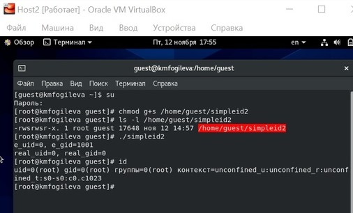{ #fig:007 width=70% }

## 8. Создала программу readfile.c (рис.8).
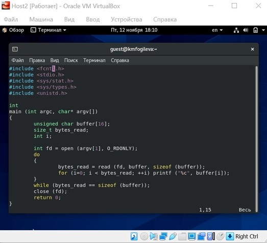{ #fig:008 width=70% }

## 9. Смените владельца у файла readfile.c (рис.9).
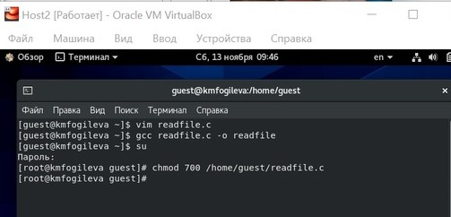{ #fig:009 width=70% }

## 10. Проверила, что пользователь guest не может прочитать файл readfile.c. (рис.10)
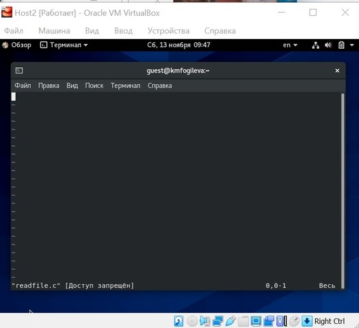{ #fig:010 width=70% }

## 11. Сменила у программы readfile владельца и установила SetU’D-бит. Проверила, может ли программа readfile прочитать файл readfile.c (рис.11).
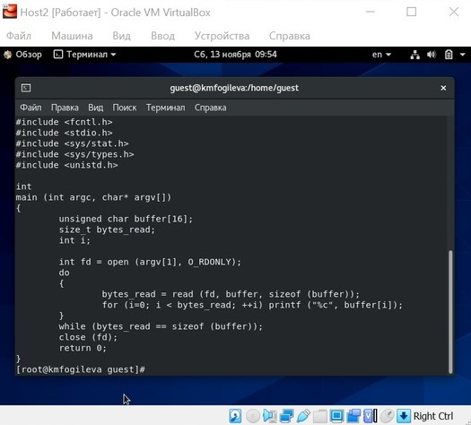{ #fig:011 width=70% }

## 12. Проверила, может ли программа readfile прочитать файл /etc/shadow (рис.12)
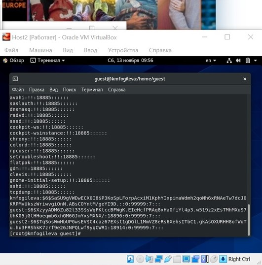{ #fig:012 width=70% }

## 13. Выяснила, установлен ли атрибут Sticky на директории /tmp. От имени пользователя guest создала файл file01.txt в директории /tmp
со словом test. Просмотрела атрибуты у только что созданного файла и разрешила чтение и запись (рис.13)
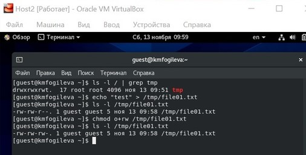{ #fig:013 width=70% }

## 14. Выполнила действия от имени пользователя guest2. Не получилось только удалить файл. (рис.14)
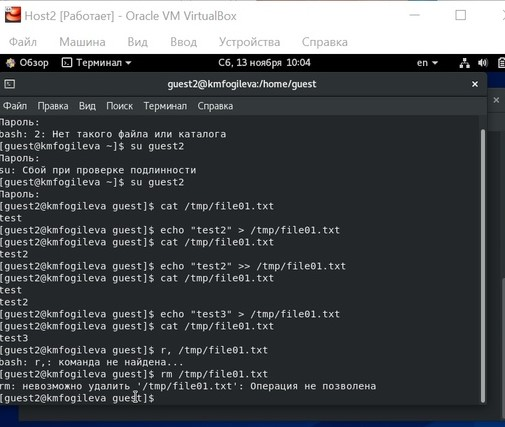{ #fig:014 width=70% }

## 15. Выполнила команду, снимающую атрибут t (Sticky-бит) с
директории /tmp от имени суперпользователя. (рис.15).
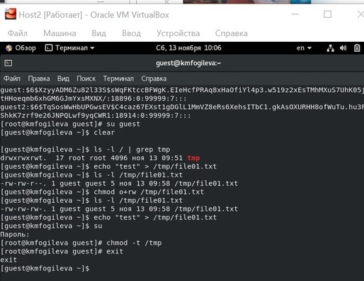{ #fig:015 width=70% }

## 16. Повторите предыдущие шаги от имени пользователя guest2, теперь можно удалить файл. (рис.16)
 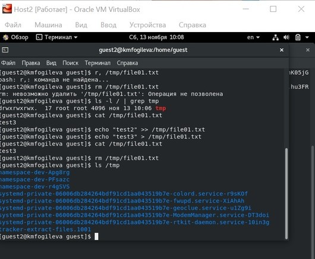{ #fig:016 width=70% }

## 17. Повысила свои права до суперпользователя и вернула атрибут t на директорию /tmp. (рис. 17)
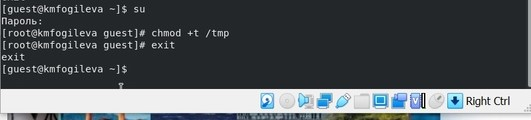{ #fig:017 width=70% }

# Выводы

## Выводы

Изучила механизмы изменения идентификаторов, применения
SetUID- и Sticky-битов. Получила практическе навыки работы в консоли с дополнительными атрибутами. Рассмотрела работу механизма
смены идентификатора процессы пользователей, а также влияние бита
Sticky на запись и удаление файлов.

## {.standout}

Спасибо за внимание!