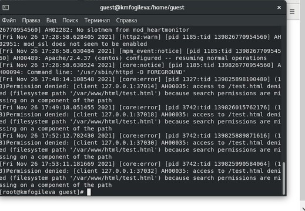

---
## Front matter
lang: ru-RU
title: "Лабораторная работа №6"
author: |
	Fogileva Ksenia Mikhailovna\inst{1}

institute: |
	\inst{1}RUDN University, Moscow, Russian Federation
	
date: 29.10.2021, Moscow, Russian Federation

## Formatting
toc: false
slide_level: 2
theme: metropolis
header-includes: 
 - \metroset{progressbar=frametitle,sectionpage=progressbar,numbering=fraction}
 - '\makeatletter'
 - '\beamer@ignorenonframefalse'
 - '\makeatother'
aspectratio: 43
section-titles: true
---

# Цель выполнения лабораторной работы

## Цель выполнения лабораторной работы

Развить навыки администрирования ОС Linux. Получить первое практическое знакомство с технологией SELinux. Проверить работу SELinx на практике совместно с веб-сервером Apache.

# Ход выполнения лабораторной работы

## 1. Вошла в систему с полученными учётными данными и убедилась, что SELinux работает в режиме enforcing политики targeted с помощью команд getenforce и sestatus.(рис. -@fig:001). 

{ #fig:001 width=70% }

## 2. Обратилась с помощью браузера к веб-серверу, запущенному на компьютере, и убедилась, что последний работает: service httpd status(рис. -@fig:002).

{ #fig:002 width=70% }

## 3. Нашла веб-сервер Apache в списке процессов, определила его контекст безопасности. (рис. -@fig:003). 

{ #fig:003 width=70%}

## 4. Посмотрела текущее состояние переключателей SELinux для Apache с помощью команды: sestatus -bigrep httpd. Обратила внимание, что многие из них находятся в положении «off». (рис. -@fig:004). 

{ #fig:004 width=70% }

## 5. Посмотрела статистику по политике с помощью команды seinfo, также определила множество пользователей(8), ролей(14), типов(4793). Определила тип файлов и поддиректорий, находящихся в директории /var/www, с помощью команды: ls -lZ /var/www. Определила тип файлов, находящихся в директории /var/www/html: ls -lZ /var/www/html. Определила круг пользователей, которым разрешено создание файлов в директории /var/www/html. (рис. -@fig:005). 

{ #fig:005 width=70% }

## 6. Создала от имени суперпользователя (так как в дистрибутиве после установки только ему разрешена запись в директорию) html-файл /var/www/html/test.html(рис. -@fig:006). 

{ #fig:006 width=70% }

## 7. Проверила контекст созданного файла. httpd_sys_content_t (рис. -@fig:007). 

{ #fig:007 width=70% }

## 8. Обратилась к файлу через веб-сервер, введя в браузере адрес http://127.0.0.1/test.html. Убедилась, что файл был успешно отображён. (рис. -@fig:008). 

{ #fig:008 width=70% }

## 9. Проверила контекст файла командой: ls -Z /var/www/html/test.html (рис. -@fig:009). 

{ #fig:009 width=70% }

## 10. Изменила контекст файла /var/www/html/test.html с httpd_sys_content_t на samba_share_t. После этого проверила, что контекст поменялся. (рис. -@fig:010). 

{ #fig:010 width=70% }

## 11. Попробовала ещё раз получить доступ к файлу через веб-сервер, введя в
браузере адрес http://127.0.0.1/test.html. Получили сообщение об ошибке. (рис. -@fig:011).

{ #fig:011 width=70% }

## 12. Проанализировала ситуацию. Файл не был отображён потому что мы изменили контекст файла. Просмотрела log-файлы веб-сервера Apache. Также просмотрела системный лог-файл: tail /var/log/messages (рис. -@fig:012), (рис. -@fig:013). 

{ #fig:012 width=70% }

{ #fig:013 width=70% }

## 13. Попробовала запустить веб-сервер Apache на прослушивание ТСР-порта 81 (а не 80, как рекомендует IANA и прописано в /etc/services). Для этого в файле /etc/httpd/httpd.conf нашла строчку Listen 80 и замените её на Listen 81.(рис. -@fig:014). 

{ #fig:014 width=70% }

## 14. Проанализиировала лог-файлы. Просмотрела файлы /var/log/http/error_log, /var/log/http/access_log и /var/log/audit/audit.log. (рис. -@fig:015), (рис. -@fig:016), (рис. -@fig:017), (рис. -@fig:018).

{ #fig:015 width=70% }

# { #fig:016 width=70% }

# { #fig:017 width=70% }

# { #fig:018 width=70% }

## 15. Выполнила команду: semanage port -a -t http_port_t -р tcp 81. После этого проверила список портов командой: semanage port -l | grep http_port_t. Убедилась, что порт 81 появился в списке. (рис. -@fig:019).

{ #fig:019 width=70% }

## 16. Вернула контекст httpd_sys_cоntent__t к файлу /var/www/html/test.html: chcon -t httpd_sys_content_t /var/www/html/test.html. После этого попробовала получить доступ к файлу через веб-сервер, введя в браузере адрес http://127.0.0.1:81/test.html. Увидели содержимое файла — слово «test». (рис. -@fig:020), (рис. -@fig:021).

# { #fig:020 width=70% }

# { #fig:021 width=70% }

## 17. Исправила обратно конфигурационный файл apache, вернувListen80. (рис. -@fig:022).

{ #fig:022 width=70% }

## 18. Удалила привязку http_port_t к 81 порту. (рис. -@fig:023).

{ #fig:023 width=70% }

## 19. Удалила файл /var/www/html/test.html. (рис. -@fig:024).

{ #fig:024 width=70% }

# Выводы

## Выводы

На основе проделанной работы развила навыки администрирования ОС Linux. Получила первое практическое знакомство с технологией SELinux. Проверила работу SELinx на практике совместно с веб-сервером Apache.
Sticky на запись и удаление файлов.

## {.standout}

Спасибо за внимание!